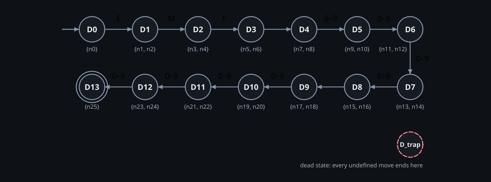

# NFA → DFA (Subset Construction) — Employee ID Validator

## 1. Algorithm (`app/core/nfa.py::subset_construction`)

1. Start subset = ε-closure({n0}); it becomes DFA state `D0`.
2. For each unprocessed subset `S` and each symbol `a ∈ Σ`: compute `move(S, a)`, then its ε-closure.
3. Each new non-empty subset becomes a new DFA state; the empty subset becomes the explicit dead state `D_trap`.
4. A subset is accepting iff it contains an accepting NFA state.

Symbols with the same outcome are grouped in the table (`Symbols a`).

## 2. Conversion trace

`*` marks accepting DFA states. Note the ε-closure at work: after `E`, `move` gives `{n1}` but the closure is `{n1, n2}`.

<!-- BEGIN generated:subset-table -->
| DFA state | NFA subset | Symbols a | move(S, a) | ε-closure | Target |
|---|---|---|---|---|---|
| D0 | {n0} | M, P, -, 0–9 | ∅ | ∅ | D_trap |
|  |  | E | {n1} | {n1, n2} | D1 |
| D1 | {n1, n2} | E, P, -, 0–9 | ∅ | ∅ | D_trap |
|  |  | M | {n3} | {n3, n4} | D2 |
| D2 | {n3, n4} | E, M, -, 0–9 | ∅ | ∅ | D_trap |
|  |  | P | {n5} | {n5, n6} | D3 |
| D3 | {n5, n6} | - | {n7} | {n7, n8} | D4 |
|  |  | E, M, P, 0–9 | ∅ | ∅ | D_trap |
| D4 | {n7, n8} | E, M, P, - | ∅ | ∅ | D_trap |
|  |  | 0–9 | {n9} | {n9, n10} | D5 |
| D5 | {n9, n10} | E, M, P, - | ∅ | ∅ | D_trap |
|  |  | 0–9 | {n11} | {n11, n12} | D6 |
| D6 | {n11, n12} | E, M, P, - | ∅ | ∅ | D_trap |
|  |  | 0–9 | {n13} | {n13, n14} | D7 |
| D7 | {n13, n14} | E, M, P, - | ∅ | ∅ | D_trap |
|  |  | 0–9 | {n15} | {n15, n16} | D8 |
| D8 | {n15, n16} | - | {n17} | {n17, n18} | D9 |
|  |  | E, M, P, 0–9 | ∅ | ∅ | D_trap |
| D9 | {n17, n18} | E, M, P, - | ∅ | ∅ | D_trap |
|  |  | 0–9 | {n19} | {n19, n20} | D10 |
| D10 | {n19, n20} | E, M, P, - | ∅ | ∅ | D_trap |
|  |  | 0–9 | {n21} | {n21, n22} | D11 |
| D11 | {n21, n22} | E, M, P, - | ∅ | ∅ | D_trap |
|  |  | 0–9 | {n23} | {n23, n24} | D12 |
| D12 | {n23, n24} | E, M, P, - | ∅ | ∅ | D_trap |
|  |  | 0–9 | {n25} | {n25} | D13 |
| D13 * | {n25} | E, M, P, -, 0–9 | ∅ | ∅ | D_trap |
| D_trap | ∅ | E, M, P, -, 0–9 | ∅ | ∅ | D_trap |
<!-- END generated:subset-table -->

## 3. The resulting DFA (before minimization)

<!-- BEGIN generated:dfa-tuple -->
```text
M_DFA = (Q, Σ, δ, q₀, F)
Q  = {D0, D1, D2, D3, D4, D5, D6, D7, D8, D9, D10, D11, D12, D13, D_trap}   (15 states)
Σ  = {E, M, P, -, 0, 1, 2, 3, 4, 5, 6, 7, 8, 9}   (14 symbols)
q₀ = D0
F  = {D13}
```
<!-- END generated:dfa-tuple -->

δ is **total**: every undefined move goes to `D_trap` (shown in every empty cell).

<!-- BEGIN generated:dfa-table -->
| State | E | M | P | - | 0–9 |
|---|---|---|---|---|---|
| → D0 | D1 | D_trap | D_trap | D_trap | D_trap |
| D1 | D_trap | D2 | D_trap | D_trap | D_trap |
| D2 | D_trap | D_trap | D3 | D_trap | D_trap |
| D3 | D_trap | D_trap | D_trap | D4 | D_trap |
| D4 | D_trap | D_trap | D_trap | D_trap | D5 |
| D5 | D_trap | D_trap | D_trap | D_trap | D6 |
| D6 | D_trap | D_trap | D_trap | D_trap | D7 |
| D7 | D_trap | D_trap | D_trap | D_trap | D8 |
| D8 | D_trap | D_trap | D_trap | D9 | D_trap |
| D9 | D_trap | D_trap | D_trap | D_trap | D10 |
| D10 | D_trap | D_trap | D_trap | D_trap | D11 |
| D11 | D_trap | D_trap | D_trap | D_trap | D12 |
| D12 | D_trap | D_trap | D_trap | D_trap | D13 |
| D13 * | D_trap | D_trap | D_trap | D_trap | D_trap |
| D_trap | D_trap | D_trap | D_trap | D_trap | D_trap |
<!-- END generated:dfa-table -->



## 4. Determinism

For every state and every symbol of Σ there is exactly one next state, so a run is a single path.
A symbol outside Σ is not in δ's domain: `DFA.step` raises, and the simulator's Layer 1 rejects such
input before the automaton runs.

## 5. Verification

`tests/core/test_nfa_pipeline.py`, `tests/core/test_equivalence.py` (exact product-automaton equality of the
subset DFA and the minimal DFA, plus oracle comparison).
