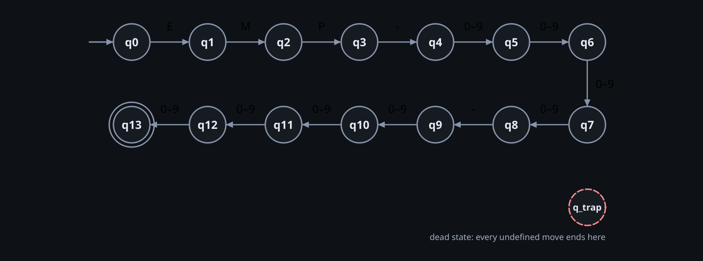

# DFA Minimization — Employee ID Validator

## 1. Algorithm (`app/core/minimizer.py::minimize`)

Moore partition refinement (Hopcroft's worklist variant computes the same partition faster; with 15 states
that is irrelevant):

1. Remove states unreachable from the start state.
2. P₀ = { F, Q ∖ F }.
3. Repeat: split a block whenever two members reach different blocks on some symbol. Every pass is recorded as a *round*.
4. Stop when nothing splits; merge each block into one state and rename by BFS order (`q0`, `q1`, …; dead state `q_trap`).

## 2. Result

<!-- BEGIN generated:min-summary -->
States 15 → 15; unreachable removed: none; merged groups: none (already minimal); partition refinement stabilised after 13 rounds.
<!-- END generated:min-summary -->

**No states merge: the DFA produced by subset construction is already minimal.** That is a result, not a skipped
step — the refinement below is the evidence.

## 3. Refinement rounds

Each round isolates exactly one more state, working backwards from the accepting state:

<!-- BEGIN generated:min-rounds -->
| Round | Blocks | Partition |
|---|---|---|
| P0 | 2 | {D0, D1, …, D_trap} (14)  {D13} |
| P1 | 3 | {D0, D1, …, D_trap} (13)  {D12}  {D13} |
| P2 | 4 | {D0, D1, …, D_trap} (12)  {D11}  {D12}  {D13} |
| P3 | 5 | {D0, D1, …, D_trap} (11)  {D10}  {D11}  {D12}  {D13} |
| P4 | 6 | {D0, D1, …, D_trap} (10)  {D9}  {D10}  {D11}  {D12}  {D13} |
| P5 | 7 | {D0, D1, …, D_trap} (9)  {D8}  {D9}  {D10}  {D11}  {D12}  {D13} |
| P6 | 8 | {D0, D1, …, D_trap} (8)  {D7}  {D8}  {D9}  {D10}  {D11}  {D12}  {D13} |
| P7 | 9 | {D0, D1, …, D_trap} (7)  {D6}  {D7}  {D8}  {D9}  {D10}  {D11}  {D12}  {D13} |
| P8 | 10 | {D0, D1, …, D_trap} (6)  {D5}  {D6}  {D7}  {D8}  {D9}  {D10}  {D11}  {D12}  {D13} |
| P9 | 11 | {D0, D1, …, D_trap} (5)  {D4}  {D5}  {D6}  {D7}  {D8}  {D9}  {D10}  {D11}  {D12}  {D13} |
| P10 | 12 | {D0, D1, D2, D_trap}  {D3}  {D4}  {D5}  {D6}  {D7}  {D8}  {D9}  {D10}  {D11}  {D12}  {D13} |
| P11 | 13 | {D0, D1, D_trap}  {D2}  {D3}  {D4}  {D5}  {D6}  {D7}  {D8}  {D9}  {D10}  {D11}  {D12}  {D13} |
| P12 | 14 | {D0, D_trap}  {D1}  {D2}  {D3}  {D4}  {D5}  {D6}  {D7}  {D8}  {D9}  {D10}  {D11}  {D12}  {D13} |
| P13 | 15 | {D0}  {D1}  {D2}  {D3}  {D4}  {D5}  {D6}  {D7}  {D8}  {D9}  {D10}  {D11}  {D12}  {D13}  {D_trap} |
<!-- END generated:min-rounds -->

## 4. Why no two states are equivalent

From `qᵢ` the shortest accepted word has length `13 − i`, so states with different "fewest symbols to accept"
can never be equivalent; `q13` is the only accepting state; and `q_trap` can never accept while every other
state can. The table is computed from the automaton (not typed):

<!-- BEGIN generated:min-map -->
| Original | Minimized | Fewest symbols to accept |
|---|---|---|
| D0 | q0 | 13 |
| D1 | q1 | 12 |
| D2 | q2 | 11 |
| D3 | q3 | 10 |
| D4 | q4 | 9 |
| D5 | q5 | 8 |
| D6 | q6 | 7 |
| D7 | q7 | 6 |
| D8 | q8 | 5 |
| D9 | q9 | 4 |
| D10 | q10 | 3 |
| D11 | q11 | 2 |
| D12 | q12 | 1 |
| D13 | q13 | 0 |
| D_trap | q_trap | ∞ (dead) |
<!-- END generated:min-map -->

## 5. The minimized DFA

<!-- BEGIN generated:min-tuple -->
```text
M_min = (Q, Σ, δ, q₀, F)
Q  = {q0, q1, q2, q3, q4, q5, q6, q7, q8, q9, q10, q11, q12, q13, q_trap}   (15 states)
Σ  = {E, M, P, -, 0, 1, 2, 3, 4, 5, 6, 7, 8, 9}   (14 symbols)
q₀ = q0
F  = {q13}
```
<!-- END generated:min-tuple -->

<!-- BEGIN generated:min-table -->
| State | E | M | P | - | 0–9 |
|---|---|---|---|---|---|
| → q0 | q1 | q_trap | q_trap | q_trap | q_trap |
| q1 | q_trap | q2 | q_trap | q_trap | q_trap |
| q2 | q_trap | q_trap | q3 | q_trap | q_trap |
| q3 | q_trap | q_trap | q_trap | q4 | q_trap |
| q4 | q_trap | q_trap | q_trap | q_trap | q5 |
| q5 | q_trap | q_trap | q_trap | q_trap | q6 |
| q6 | q_trap | q_trap | q_trap | q_trap | q7 |
| q7 | q_trap | q_trap | q_trap | q_trap | q8 |
| q8 | q_trap | q_trap | q_trap | q9 | q_trap |
| q9 | q_trap | q_trap | q_trap | q_trap | q10 |
| q10 | q_trap | q_trap | q_trap | q_trap | q11 |
| q11 | q_trap | q_trap | q_trap | q_trap | q12 |
| q12 | q_trap | q_trap | q_trap | q_trap | q13 |
| q13 * | q_trap | q_trap | q_trap | q_trap | q_trap |
| q_trap | q_trap | q_trap | q_trap | q_trap | q_trap |
<!-- END generated:min-table -->



## 6. Equivalence with the original DFA

<!-- BEGIN generated:equiv-line -->
Product-automaton check, subset DFA vs minimal DFA: **EQUAL** (15 state pairs explored).
<!-- END generated:equiv-line -->

Method: BFS over the product automaton; the languages differ iff some reachable pair `(p, q)` has exactly one
accepting component, and BFS returns the *shortest* distinguishing word. `tests/core/test_equivalence.py` also
proves the check catches a single wrong transition (four mutants), compares the derived DFA with the
hand-written reference table in `app/data/id_rules.py`, and runs exhaustive (all words ≤ 4) and random comparisons
against a PCRE oracle.

A redundant DFA (two pairs of equivalent states plus an unreachable one) is minimized correctly in
`tests/core/test_minimization.py`, so merging is exercised even though this language needs none.
