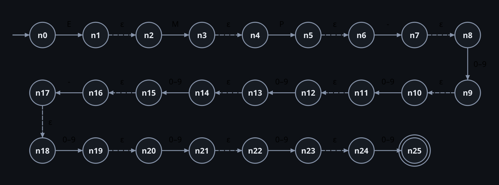

# ε-NFA — Employee ID Validator

## 1. Construction (Thompson)

The NFA is **built from the regular expression** by `app/core/nfa.py::thompson`:

- every atom (a literal, or the digit class `D`) becomes two states joined by its symbol(s);
- consecutive atoms are glued with an **ε-edge**;
- the digit class is Thompson's union `(0 ∪ … ∪ 9)` collapsed into one atom with ten parallel edges
  (the usual character-class shortcut; ten separate branches per digit would add ~170 states).

13 atoms → 26 states and 12 ε-edges. An NFA has no trap state: a missing move means ∅.

## 2. Formal definition

<!-- BEGIN generated:nfa-tuple -->
```text
M_NFA = (Q, Σ, δ, q₀, F)
Q  = {n0, n1, …, n25}   (26 states)
Σ  = {E, M, P, -, 0, 1, 2, 3, 4, 5, 6, 7, 8, 9}   (14 symbols)
q₀ = n0
F  = {n25}
```
<!-- END generated:nfa-tuple -->

## 3. Transition table

`→` marks the start state, `*` the accepting state; a cell shows the *set* δ(state, symbol); the last column is
the ε-move. The column `0–9` stands for ten identical columns.

<!-- BEGIN generated:nfa-table -->
| State | E | M | P | - | 0–9 | ε |
|---|---|---|---|---|---|---|
| → n0 | {n1} | ∅ | ∅ | ∅ | ∅ | ∅ |
| n1 | ∅ | ∅ | ∅ | ∅ | ∅ | {n2} |
| n2 | ∅ | {n3} | ∅ | ∅ | ∅ | ∅ |
| n3 | ∅ | ∅ | ∅ | ∅ | ∅ | {n4} |
| n4 | ∅ | ∅ | {n5} | ∅ | ∅ | ∅ |
| n5 | ∅ | ∅ | ∅ | ∅ | ∅ | {n6} |
| n6 | ∅ | ∅ | ∅ | {n7} | ∅ | ∅ |
| n7 | ∅ | ∅ | ∅ | ∅ | ∅ | {n8} |
| n8 | ∅ | ∅ | ∅ | ∅ | {n9} | ∅ |
| n9 | ∅ | ∅ | ∅ | ∅ | ∅ | {n10} |
| n10 | ∅ | ∅ | ∅ | ∅ | {n11} | ∅ |
| n11 | ∅ | ∅ | ∅ | ∅ | ∅ | {n12} |
| n12 | ∅ | ∅ | ∅ | ∅ | {n13} | ∅ |
| n13 | ∅ | ∅ | ∅ | ∅ | ∅ | {n14} |
| n14 | ∅ | ∅ | ∅ | ∅ | {n15} | ∅ |
| n15 | ∅ | ∅ | ∅ | ∅ | ∅ | {n16} |
| n16 | ∅ | ∅ | ∅ | {n17} | ∅ | ∅ |
| n17 | ∅ | ∅ | ∅ | ∅ | ∅ | {n18} |
| n18 | ∅ | ∅ | ∅ | ∅ | {n19} | ∅ |
| n19 | ∅ | ∅ | ∅ | ∅ | ∅ | {n20} |
| n20 | ∅ | ∅ | ∅ | ∅ | {n21} | ∅ |
| n21 | ∅ | ∅ | ∅ | ∅ | ∅ | {n22} |
| n22 | ∅ | ∅ | ∅ | ∅ | {n23} | ∅ |
| n23 | ∅ | ∅ | ∅ | ∅ | ∅ | {n24} |
| n24 | ∅ | ∅ | ∅ | ∅ | {n25} | ∅ |
| n25 * | ∅ | ∅ | ∅ | ∅ | ∅ | ∅ |
<!-- END generated:nfa-table -->

## 4. State diagram



Dashed edges are ε-transitions.

## 5. Verification

- `tests/core/test_nfa_pipeline.py` — structure (26 states, 12 ε-edges), ε-closure really used, a genuinely
  nondeterministic NFA converts correctly.
- `tests/core/test_equivalence.py` — NFA agrees with the PCRE oracle on every word up to length 4,
  on neighbours of valid IDs and on 20 000 random words.
